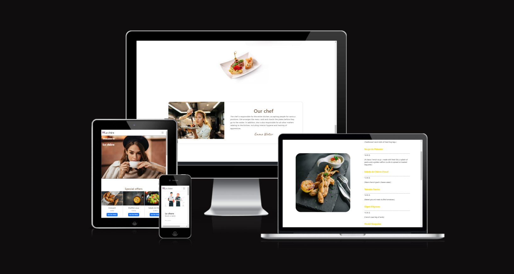
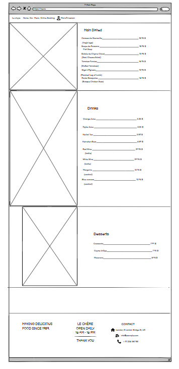
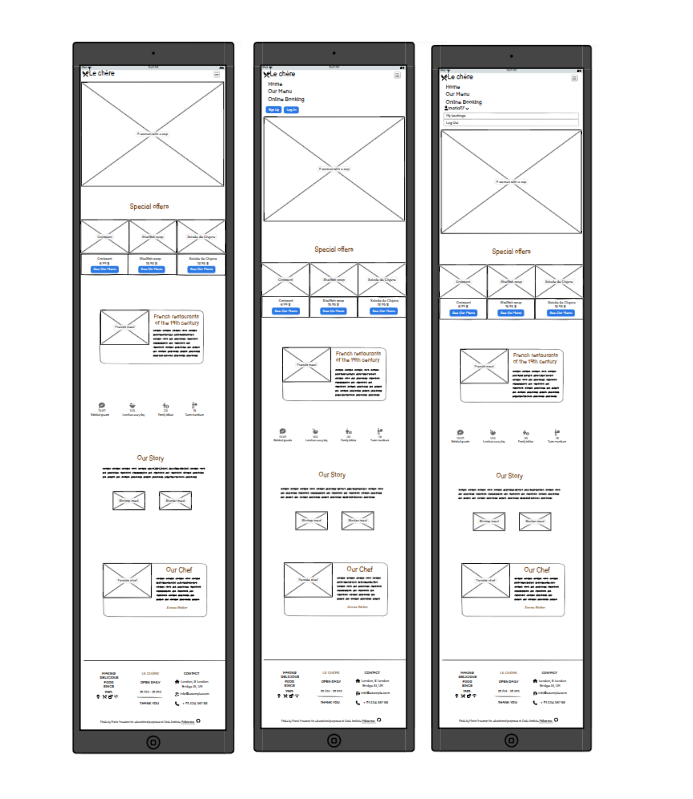

# Restaurant Le chère

[View the live project here](https://portfolio-project4-restaurant-7e7cbe473f3c.herokuapp.com/)
Here is the reservation system for Le chère Restaurant created in Django for Portfolio Project 4 - Python + Django Essentials for Diploma in Full Stack Software Development at [Code Institute](https://codeinstitute.net/se/). 

The user has the ability to book one or more guests for a meal at the restaurant for a specific time and date, and has the ability to edit or delete reservations.
The website owner has the ability to accept online reservations for this restaurant.

# Table of content

- [User Experience (UX)](#user-experience-ux)
    - [Strategy](#strategy)
    - [USER STORIES](#user-stories)
- [Features](#features)
    - [Existing Features](#existing-features)
    - [Features Left to Implement](#features-which-could-be-implemented-in-the-future)
- [Design](#design)
    - [Wireframe](#wireframe)
- [Testing](#testing)
- [Deployment](#deployment)
- [Technologies Used](#technologies-used)
    - [Languages Used](#languages-used)
    - [Frameworks, Libraries and Programs Used](#frameworks-libraries-and-programs-used)
- [Credits](#credits)
    - [Code](#code)
    - [Media](#media)

# User Experience (UX)
## Strategy:

## USER STORIES:

[Kanban board](https://github.com/users/mariaarnesson/projects/29/views/1) with my defined [USER STORIES](https://github.com/mariaarnesson/restaurant_booking_system/issues) and their acceptance criteria are available here.

- USER STORY: Navigation bar #1
    - As a **Site User** I can **use navigation menu ** to **switch to other options.**
- USER STORY: Button Home #2
    - As a **Site User** I can **select the home option** to **find out more information about the restaurant**, like **restaurant story** and **satisfied customer reviews.**
- USER STORY: Online Booking Button #3
    - As a **Site User** I can **select the online booking option** to **make table reservations.**
- USER STORY: My Bookings Button #4
    - As a **Site User** I can **select my bookings option** to check **my booking history**
- USER STORY: Log in / Log out Button #5
    - As a **Site User** I can **select the option log in/ log out** to be able **to log in or out of the site.**
- USER STORY: Our Menu #6
    - As a **Site User** I can **use the our menu option** to check **the current menu.**
- USER STORY: Admin account #7
    - As a **Admin** I can **access to all table reservations**
- USER STORY: Edit reservation #8
    - As a **logged in Site User** I can **edit/delete existing bookings** so that **I can make changes online if needed.**
- USER STORY: Account registration #9
    - As a **Site User** I can **register an account**
- USER STORY: Log in #10
    - As a **Site User** I can **register or log in** to **make table reservations**
- USER STORY: Registration #11
    - As a **Site User** I can **register** by **entering my email, password** and **confirming my password.**
- USER STORY: Password #12
    - As a **Site User** I can **easily recover my password** in case **I forget it.**     
- USER STORY: Footer layout #13
    - As a **Site User** I can **use the footer** to switch to **other options** and check **restaurant locations on the map.**
- USER STORY: Basic information on the homepage. #14
    - As a **Site User** I can **use information from the home page** so that **I will get basic information.**
- USER STORY: Lower priced meal suggestions are available on the home page. #15
    - As a **Site User** I would like to have **access to the lower priced meals shown on the home page** so that **I can take advantage of the promotion.**
- USER STORY: Icons showing customer and meal information. #16
    - As a **Site User** I am aware of the **number of guests** and **the number of meals in the restaurant** so that **I know if the restaurant has good reviews.**
- USER STORY: Chef information and photo. #17
    - As a **Site User** I want **access to information about the chef** so that **I can find out more about the restaurant.**               
- USER STORY: Create booking #18
    - As a **Site User** I can **choose the online booking option** to **reserve a table**
- USER STORY: Check reservations #19
    - As a **Site User** I can **select my bookings option** to check **my bookings history.**

 

# Features
## Existing Features
- Navigation bar
    - The navigation bar is easy to read and looks pleasent. The full responsive navigation bar includes links the Logo, Home page, Online booking, Our Menu and it is possible to log in and check the booking's history. The navigation bar is identical in each page to allow for easy navigation.
    The navigation bar is responsive on the iPod screen, the sites in the navigation bar on smallare screen are covered to the 'burger' style.

    
    

    When a user is not logged in, it is possible to register or log in:

    

    The logged in user has the ability to make a reservation and check the reservations in the booking history, and the ability to log out:
    

      The navigation bar will allow the user to easily navigate from page to page on all devices without returning to the previous page using the "Back" button.

- Home Page
    - After the page loads, a picture of a women with a cup is shown as the main picture that introduces the text about the restaurant.

    

        - Introduction text
    - Scrolling down a few words from the author is introducing and setting out what the website is presenting and the general information about the restaurant is being told.

    - Home Page Photos of foods
    - The next part of the main page shows four photos of food nicely arranged  one above the other. The photos present meals served in the restaurant.

    

    - Home Page Introduction Text

    

    - Home Page - short description about the restaurant

    

    - Home Page - about a chef to the restaurant

    

- Footer
    - The footer includes restaurant's location, address and opening hours are presented.

    - The background of the footer is slightly darker to show the contrast between the text in a distinctive way.

    

- Menu
    - The menu page gives a list of meals served in the restaurant. There is described the meals, drinks and the price of them.

    - Menu- main dishes

    

    - Menu- drinks

    

    - Menu- desserts

    

    - Booking Online Page
    - The user has to be logged in to reserve a table. There is a possibility to book a table on the online booking website. The user selects the date/time of the reservation from the drop-down list and can select the number of guests from 1 to 5 to indicate how many people they want to include in their booking, and select a occassion from existing in the form. The user then clicks the Add reservation button to complete the booking and is redirected to the My Bookings page to see all upcoming and past bookings.

    - Booking Online Page:

    

    - Booking Online Page on small screen:
    

- My Bookings Page

      

    - Remove booking.

    

- Sign up/ Log in / Log out
    - Sign Up Page
       - After opening the sign up page, a photo and a form to fill out are displayed. For this purpose, the user should fill in his contact details, such as: username, email and password.

       

    - Log In Page
       - After opening the login page, a photo and a form to fill out are displayed. The user should fill in the username and password for this purpose.

       

    - Log Out Page
        - When the log out page is opened, a message is displayed asking if the user is sure that he/ she wants to log out, and a button: "log out" is displayed.

           

## Features which could be implemented in the future:
- video supporting the facts:
    - By adding a video about the restaurant, the user could learn more about restaurant and localisation.
- video as a background to the online booking page.
# Design
## Wireframe: 
- Wireframe Desktop:
    - Home Page
        
    

    - Menu Page

    

    - Booking Online Page

    

    - My Bookings Page

    

    - Log In Page

    

    - Sign Up Page

    

    - Log Out Page

    

- Wireframe on smaller screen

    - Home Page
    

    - Menu Page

    

    - Online Booking

    

    - My bookings Page

    

## Diagram

The presented diagram shows a logical data model. 
- Thanks to the 'No of guest' class, each user can select the number of people booking one table. 
- The ability to choose the time of the booked table is marked as TIME CHOICES. 
- The opportunity to choose the occasion of the booked table is marked as OCCASSION CHOICES. 
- The choice of table type is marked as TABLE CHOICES.

# Testing 

Testing information can be found in separate [TESTING.md](TESTING.md) file.

# Deployment:

Here is described how my project got deployed to Heroku. The steps were done using [Django Blog Cheat Sheet](https://codeinstitute.s3.amazonaws.com/fst/Django%20Blog%20Cheat%20Sheet%20v1.pdf).

## Deploying the app to Heroku

- Create a Heroku app.
To create a [Heroku](https://dashboard.heroku.com) application, after log in, on the main page you should press the button: 'New', which is located on the upper right side. From the dropdown you should select: 'Create new app' option. Then you go to the next page, where you should fill a form with the following data: 'App name' and 'Choose a region', and then you should press button: 'Create app'.

Once the Heroku app is created, the next step is to go to option: 'settings'. In the category called 'Config Vars', you should press 'Reveal Config Vars' button, and then you have possibility to enter the KAY and VALUE for individual properties of:

   - DATABASE_URL:

    To create DATABASE_URL, you need log in to the [ElephantSQL](https://www.elephantsql.com/). On the top right side of this page, you need to press button: 'Creata New Instance'. Then you need to fill out a short form, where you select a plan and name. After that you should press 'Select Region'button. After entering the region, press the button: 'review' and then your instance is created. On your instance's panel, you can see the details. Then you should copy the link, which is placed next to option 'URL'. 

    This link is needed to enter as VALUE to KEY - DATABASE_URL to Config Vars on Heroku.

    - SECRET_KEY
    
    To create a SECRET_KEY you can use the [Django Secret Key Generator](https://miniwebtool.com/django-secret-key-generator/). You should press a button: 'Generate Django Secret Key' and copy Generated Django Secret Key.

    This key is needed to enter as VALUE to KEY - SECRET_KEY to Config Vars on Heroku.

    
    - CLOUDINARY_URL

    To create CLOUDINARY_URL, you need log in to the [Cloudinary](https://cloudinary.com/). By pressing the option 'dashboard', you will be taken to the page where the Product Environment Credentials is aviliable. Nex to the option 'API Environment variable', there is a link you should copy.

    This link is needed to enter as VALUE to KEY - CLOUDINARY_URL to Config Vars on Heroku.

    - DISABLE_COLLECTSTATIC

    Value of DISABLE_COLLECTSTATIC should be 1

    - PORT
    Value of PORT should be 8000.

## Creating a respository on GitHub

[GitHub Full Template](https://github.com/Code-Institute-Org/gitpod-full-template) was used to create my project. The green dropdown placed on the top right side on this page: 'Use this template' was pressed. After that 'Create a new respository' button was selected. After that you will be taken to another page, on a tab: 'Owner*', is your username selected, on a tab: 'Repository name*' you should give a name to your repository. Bellow that, in a tab 'Description (optional)' you have possibility to give your repository a short description.
Below that, there is an option to choose to make your repository private or public.
Finally, when everything is filled, you should press the button: 'Create repository'.

## Connecting the Heroku application to the GitHub repository

On the [Heroku page](https://dashboard.heroku.com), select the panel of your application that you have already created and press 'deploy'. Under the 'Deployment method' category, select the option: 'Connect to GitHub'. Below you will find: 'Search for a repository to connect to'. Bellow that enter your GitHub username, and your repository name, then press button: 'Search'. Underneath you should see the name of your GitHub respository and a 'Connect' button. Now there are two options to choose: either use 'Automatic deploys' or 'Manual deploy'.

I use the option: 'Manual deploy'. Next to a option: 'Choose a branch to deploy', select: 'main' and press button: 'Deploy Branch'. You have to wait a while while branch main builds up. When the branch is build and completed successfully, you will see a message: 'Your app was successfully deployed' and a button: 'View'. Enter 'View' to see the live project.
The live link can be found here - [View the live project here](https://portfolio-project4-restaurant-7e7cbe473f3c.herokuapp.com/).

Detailed instructions for configuring and deploying the application are described below. For summary information see: [CI Cheat Sheet]().

[Code Institute Full Template](https://github.com/Code-Institute-Org/gitpod-full-template) was used to create my Django application.

    This is fellows steps, which was made:
    - Click the 'Use this template' button.
    - Add the name of the repository.
    - Add a description of the respository.
    - Press button 'Create repository' to create a repository.
    - On GitHub dashboard, press button 'Gitpod' to create Gitpod Workspace.   

- The site was deployed to GitHub pages. The steps to deploy are as follows:
   
    - Login to Heroku
    - In the Heroku, select: Create new app
    - Enter name of the app
    - Enter region of the app
    - Navigate to the Settings tab.
    - In 'Config Vars' select 'PORT' as a key to and '8000' as a value
    - In 'Config Vars' select 'DISABLE_COLLECTSTATIC' as a key to and '1' as a value.
    - In 'Config Vars' select 'DATABASE_URL' as a key and select value
    - In 'Config Vars' select 'SECRET_KEY' as a key and select value
    - In 'Config Vars' select 'CLOUDINARY_URL' as a key and select value
    - From the tab on the top, select: Deploy.
    - Afrerword select Github and connect.
    - Enter the respository name on Github and select: Search
    - Click connect button.
    - In Manual deploy, select the 'Deploy Branch' option
    - Select 'Open app' on the right hand side of the screen
    - The app should appear in a new tab on the web browser
    - The live link can be found here - [View the live project here]()

    Here are the final steps that should be taken to deploy the application:

- The application can be prepared for Heroku deployment, when code changes have been completed and tested on localhost.

    - in settings.py the DEBUG flag should be set to False.
    - in settings.py 'X_FRAME_OPTIONS' should be set to 'SAMEORIGIN'.
    - use the command: 'pip3 freeze --local > requirements.txt' to make the requirements.txt file up-to-date.
    - Config Vars 'DISABLE_COLLECTSTATIC' in Heroku should be now deleted. 
    - On the Heroku dashboard go to the Deploy tab for the application and click on deploy branch.

-  Detailed desciption steps to clone the repository:
    - go to this page: https://github.com/mariaarnesson/restaurant_booking_system
    - press button 'Code' and copy the link placed under HTTPS.
    - after opening GitBush terminal, you should navigate to the directory and locate the clone. 
    - to begin the clone process, on the command line, type "git clone" then paste in the copied url and press the Enter key.
    - use the command : pip install -r requirements.txt to install the packages required by the application. 
    - set DEBUG=True in the settings.py file, to developing and running the application locally.
    - using the following commands, changes made to the local clone can be pushed back to the repository:
        - git add . (or filenames)
        - git commit -m "describe a message with changes that have been made"
        - git push
    - N.B. Any changes pushed to the master branch will take effect on the live project once the application is re-deployed from Heroku
# Planning
## Technologies Used
### Languages Used
- [HTML](https://sv.wikipedia.org/wiki/HTML)
- [CSS](https://en.wikipedia.org/wiki/CSS)
- [PYTHON](https://en.wikipedia.org/wiki/Python_(programming_language))
- [JQUERY](https://en.wikipedia.org/wiki/JQuery)

### Frameworks, Libraries and Programs Used:

- [Balsamiq](https://balsamiq.com/) was used to create wireframes.
- [Font Awesome](https://fontawesome.com/) was used to create icons to footer and home page, logo.
- [Google Fonts](https://fonts.google.com/?preview.text=Love%20Running&preview.text_type=custom) was used to import 'Caveat', 'Courier New' och 'Lato' that have been used for each page.
- [Git](https://git-scm.com/) was used  by utilising the Gitpod terminal to commit to Git and Push to GitHub.
- [GitHub](https://github.com/) was used as a repository for code of the project. 
- [Django](https://www.djangoproject.com/) was used as the framework to support rapid and secure development of the application.
- [Bootstrap](https://getbootstrap.com/) was used to build responsive webbpages.

# Credits
## Code:

- meals
[Traditional French dish of fried frog legs.](https://www.tasteatlas.com/cuisses-de-grenouilles#:~:text=Cuisses%20de%20grenouilles%20is%20a,and%20parsley%20until%20well%20done.)
- This page was used to help bild a lay out to Log in, Log out, Sign up, Online booking and Our menu - [MDB](https://mdbootstrap.com/docs/standard/extended/login/)
- [French soup descrition](https://www.deliciousmagazine.co.uk/recipes/soupe-de-poissons/)
- [Warm French Goat’s Cheese Salad](https://www.recipetineats.com/warm-french-goats-cheese-salad-salade-de-chevre-chaud/)
- [Classic Tomates Farcies](https://www.pardonyourfrench.com/classic-tomates-farcies-baked-ground-meat-stuffed-tomatoes/)
- [French Roast Leg of Lamb](https://www.curiouscuisiniere.com/french-roast-leg-of-lamb/)
- [Cuisses de Grenouille](https://www.tasteatlas.com/poulet-basquaise)
- [desserts- Crème brûlée](https://fernweheditions.com/blogs/scent-stories/creme-brulee#:~:text=Creme%20br%C3%BBl%C3%A9e%20is%20a%20French,and%20crunch%20to%20the%20dessert.)
- [Macarons](https://bakerpedia.com/processes/macaron/#:~:text=Macarons%20are%20small%2C%20delicate%20and,base%20known%20as%20the%20foot.)
- This page was used to help me include testing in correctly way - [TESTING.md](https://github.com/AJGreaves/familyhub/blob/master/testing.md)
- [TimeField](https://www.geeksforgeeks.org/timefield-django-models/)

- My codes were based on information from that site [ModelForm](https://docs.djangoproject.com/en/4.1/topics/forms/modelforms/)
## Media:
All pictures was taken from [Freepik](https://www.freepik.com/):
- [Women with a cup](https://img.freepik.com/free-photo/lifestyle-portrait-elegant-young-woman-with-dark-wavy-hairstyle-trendy-makeup-fashionable-beige-pullover-coat-sitting-cafe-terrace-drinking-coffee-from-white-cup_197531-24448.jpg?size=626&ext=jpg)
- [Croissant](https://img.freepik.com/free-photo/croissant-basket-with-cloth-wooden-table-flat-lay_176474-8128.jpg?size=626&ext=jpg)
- [Soup](https://img.freepik.com/free-photo/roasted-pumpkin-carrot-soup-with-cream-seeds-fresh-green-ceramic-bowl-top-view_114579-1660.jpg?size=626&ext=jpg)
- [Salad](https://img.freepik.com/free-photo/fresh-salad-with-vegetables-tomatoes-red-onions-lettuce-quail-eggs-healthy-food-diet-concept-vegetarian-food_2829-20246.jpg?w=1060&t=st=1684621258~exp=1684621858~hmac=2f7cb47142401da69f0fd75103c14a30eda0a833348576485ce938c824033d4c)
- [Wrap](https://images.pexels.com/photos/461198/pexels-photo-461198.jpeg?auto=compress&cs=tinysrgb&w=600)
- [Starter- meal shrimp](https://img.freepik.com/free-photo/closeup-shot-tasty-shrimp-tempura-with-sauce-white-background_181624-60475.jpg?w=1060&t=st=1684619092~exp=1684619692~hmac=214ac0dfbafdd7ecf1718ab6b4fdaeeb5703363111fb91ed3e2792b687b00d20)
- [Starter-  meal toast](https://img.freepik.com/free-photo/assortment-spanish-pintxos-isolated-white-background_123827-22327.jpg?t=st=1684619194~exp=1684619794~hmac=3781c6374a19d470d88320aa32592e659769c62a602fbbb7ec2fc7949fb951d1)
- [Female chef](https://img.freepik.com/free-photo/female-chef-carefully-pouring-sauce-dish_23-2148763167.jpg?size=626&ext=jpg)
- [Main dishes](https://res.cloudinary.com/dun5p7nsx/image/upload/v1688718119/p53pgq1zqvsj4myishcr.webp)
- [Drinks](https://res.cloudinary.com/dun5p7nsx/image/upload/v1688718175/lbpymghnmgayog1qd7de.webp)
- [Desserts- macarons](https://res.cloudinary.com/dun5p7nsx/image/upload/v1688718236/r6pnh4aoef0viy89sy8m.jpg)
- [Online booking photo](https://img.freepik.com/free-vector/waiters-concept-illustration_114360-2908.jpg?w=1060&t=st=1684266496~exp=1684267096~hmac=5f7ce09bf9265ee365e209700bfa6258f97461744c5fa1aec14eab988542d737)

